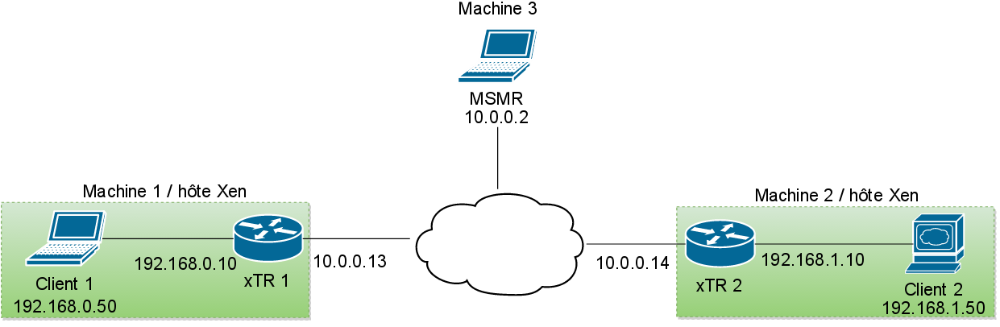

#Content

Configuration files we need to setup the demo.

```
.
├── interfaces.k		# /etc/network/interfaces pour l'hôte Xen de droite
├── interfaces.t
├── interfaces.vm.k		# /etc/network/interfaces pour la vm Debian de droite
├── interfaces.vm.t
├── vm.k.xen			# configuration Xen pour la vm Debian de droite
├── vm.t.xen
├── xtr.k.click			# configuration du xTR pour ClickOS sur la machine de droite
├── xtr.k.xen
├── xtr.t.click
└── xtr.t.xen
```

##On the filename naming

Files with 't' and 'k' match respectively the left and right Xen host on the schema below.

#Explanation of the demo

The demo involve 3 computers, two of them are Xen hosts, the other is used by the MS/MR.

Each Xen host runs:

- one ClickOS instance with xTR configuration
- one basic Debian image

The full network:



Details on the network inside a Xen host:


The goal of our demo was to demonstrate (1) that our implementation of the LISP protocol work, (2) that our implementation can work in a fully virtualized network.

To show the correctness of the protocol implementation we followed in wireshark the "journey" of a ping request. This packet is issued by the Debian VM behind the xTR on the left and arrives at the other Debian VM behind the xTR on the right.

To test the demo, launch the Debian VMs then follow the README instructions in the ../xen folder to launch both xTR.

##Environment

For this demo we used Debian "Jessy" with Xen 4.1. The MS/MR ran as a click userlevel mode on Archlinux.
